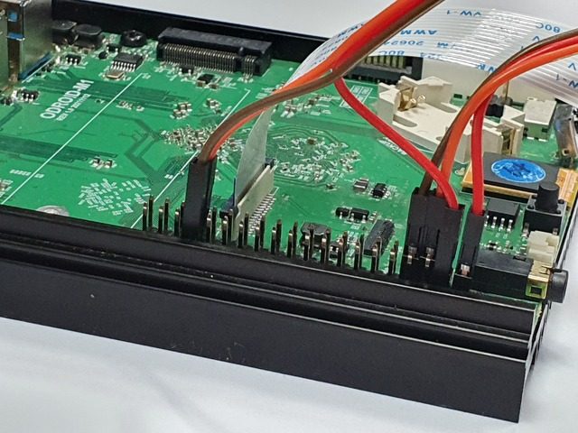

# yolo_tracking

This is a ros2 example on odroid-M1 of detecting and tracking a "cell phone" using a camera and a yolov5 model.

It transmits the coordinates of the object detected as "topic",

compares the transmitted coordinate value with the coordinate in the center,

and communicates the motor control signal through the "service".

We think it is very meaningful that this project uses NPU together in the ros2 package.

TODO:
```
The target ("mobile phone") is now hard-coded,
but will remain at its default value and will be improved so that the user can switch to parameter input.
```

### Purchase list
---------------------------------------
- [odroid-M1](https://www.hardkernel.com/shop/odroid-m1-with-4gbyte-ram)
- [ov5647](https://www.hardkernel.com/shop/m1-mipi-csi-camera-kit)
- pan/tilt braket x 1
- sg90 x 2

### requirements
---------------------------------------
- [ROS2 with NPU](https://wiki.odroid.com/getting_started/os_installation_guide#tab__odroid-m1)
- ros2 (foxy, preinstalled)
- opencv (preinstalled)
- librga-dev (preinstalled)
- odroid-wiringpi
- libwiringpi-dev

### circuit
---------------------------------------


```
[sg90 motor 1] # axis x
SIG --- phy #33
5V  --- phy #4
GRD --- phy #34

[sg90 motor 2] # axis y
SIG --- phy #7
5V  --- phy #2
GRD --- phy #9
```

### manual
---------------------------------------
0. update & upgrade kernel
```
$ sudo apt update && sudo apt upgrade -y
# Linux weston 4.19.219-odroid-arm64 #1 SMP Fri, 06 Jan 2023 05:51:03 +0000 aarch64 aarch64 aarch64 GNU/Linux
```

[WARN] Camera screen flips and motor control direction must be adjusted personally!
- [Camera screen setting](doc/camera_screen_setting.rst)
- [Motor direction setting](doc/motor_direction_setting.rst)

1. Download & Build package.
```
$ git clone https://github.com/hardkernel/ros2_yolo_tracking yolo_tracking
$ ln -s ~/ros2_yolo_tracking/motor_srv ~/robot_ws/src
$ ln -s ~/ros2_yolo_tracking ~/robot_ws/src/yolo_tracking
$ cb
```

2. execute nodes.

**terminal 1**
```
$ ros2 launch yolo_tracking image.launch.py
```

**terminal 2**
```
$ ros2 run yolo_tracking servo
```

**terminal 3**
```
$ ros2 run yolo_tracking control
```

### Youtube

[](https://youtu.be/EacS0KszQZQ)
